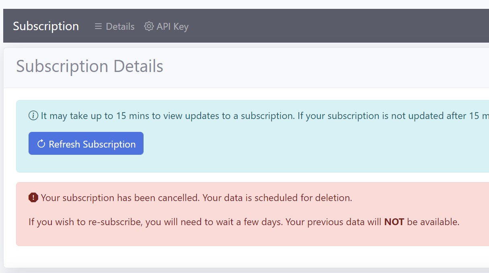

# Introduction

In this section, you will learn how to subscribe to an ICI application.

# Free subscription

- Click on the relevant button to start a free subscription for an ICI application

- Create an account if you don't have one by clicking the 'Sign up now' button in the Sign in screen

- When you successfully sign in, click on the 'Subscribe' button to start a free subscription

# View subscription details

- Open the subscription details page : **Subscription > Details**

- View the details of your subscription

# Change subscription plan

- Open the subscription details page

- Click on the 'Change Plan' button

- Select the plan and click the 'Submit' button

- Then, click the payment button

- Complete the payment instructions

- After payment, you will need to wait for 15 mins for the subscription to be updated

- Check the details page for the updated subscription

# Cancel a subscription 

- In the subscription details page, click on the 'Cancel Subscription' button

- Then click the 'Cancel' button

- You will need to wait for 15 mins for the subscription to be cancelled

- When your subscription is cancelled, you should download and back up your resources and data locally

- Your data will be deleted after a few days

- If you choose to re-subscribe, you will need to wait a few days

- Your data will not be available after you re-subscribe

